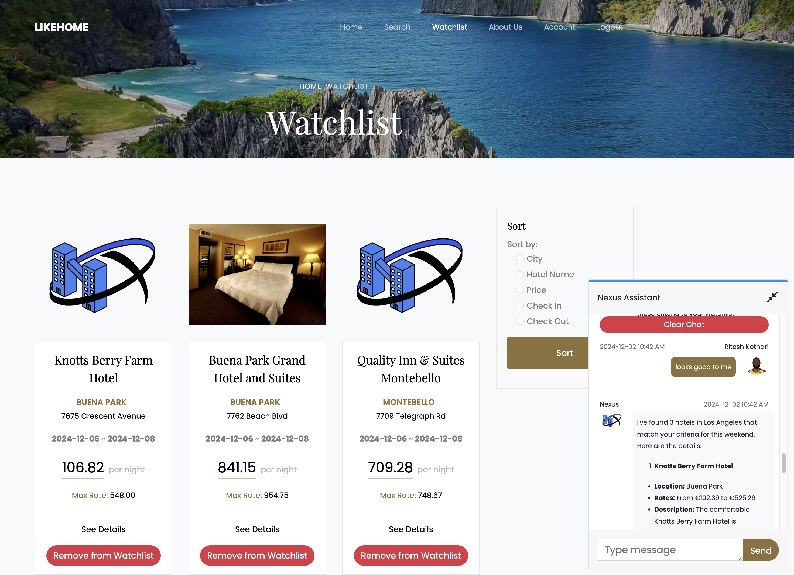

# LikeHome
CMPE 165 Team Nexus hotels.com clone. 

## Views

### Homepage

### Search Results

### Chatbot + Watchlist 

### Account

## Testing the App After Set-Up
### Environment Variables

1. Create a file named `.env` in the `LikeHome/` dir with the contents from: https://docs.google.com/document/d/14bQnqJJ0wbomVwEROi0IhHXNF5j5Ae0Ipkg3zeCoUkc/edit?tab=t.0#bookmark=id.7xh95lhio4tr

### Running Backend

2. Run `./prep_backend.sh` in the `backend/` dir to activate venv, install any new dependencies, update database schema, and run server
3. [Optional] Run `./likehome_api/views/clients/hotel_api_status.sh` to check how many hotel api requests are remaining
4. [Optional] With the backend running, access the database by visiting http://localhost:8000/admin
    * To create a superuser run `python manage.py createsuperuser` and enter username & password details for this admin account

### Running Frontend

5. Run `npm install` in the `frontend/` dir to install any new dependencies
6. Run `ng serve` to start the frontend

## Set-Up
### Cloning

1.  `git clone git@github.com:FardinHaque60/LikeHome.git` this repo using ssh

### Create a .env for secrets

2. Create a file named `.env` under `LikeHome/` with contents from: https://docs.google.com/document/d/14bQnqJJ0wbomVwEROi0IhHXNF5j5Ae0Ipkg3zeCoUkc/edit?tab=t.0#bookmark=id.7xh95lhio4tr

### Configuring the Backend

3.  `cd LikeHome` and create a venv with `python3 -m venv venv`
4.  Activate the venv with `source venv/bin/activate` (deactivate with `deactivate`)
5.  Install the python dependencies with `pip install -r requirements.txt`
6.  `cd backend` then `python manage.py makemigrations likehome_api && python manage.py migrate` to initialize the DB
    * (Note: Run `python manage.py createsuperuser` to create an admin account to access http://localhost:8000/admin, not required for running the app though)

### Configuring the Frontend

7.  Navigate to the frontend directory with `cd frontend` then `npm install` to install the frontend dependencies

### Run the Application

8.  With one terminal in the backend directory run `python manage.py runserver` to start the backend
9.  In another terminal in the frontend directory run `ng serve` to start the frontend
10.  visit http://localhost:4200/ to use the app

### Side Notes

11. Visit 
    * http://localhost:8000/admin for Django admin dashboard to see the database values, add records, etc.
    * http://localhost:8000/[view name] to debug the API endpoint

## FAQ

### Resetting master branch

1. If you are trying to `git pull origin master` and your master branch has diverged for any reason and you need to reset it to origin run the following commands:
* `git fetch origin`
* `git reset --hard origin/master`
* `git pull origin master`  
This will force overwrite any changes you have on your local master with the remote version

## [OPTIONAL] Detailed Set-Up
Reference below if you are interested in the details of setting up the app from scratch, not necessary if following this github repo:
See this [detailed guide](https://docs.google.com/document/d/1slV_IaDIUy8Cx1ohTbfUQ5w1YkLrxQFsPOAyUyFd03s/edit?usp=sharing) on how the app was made from scratch.